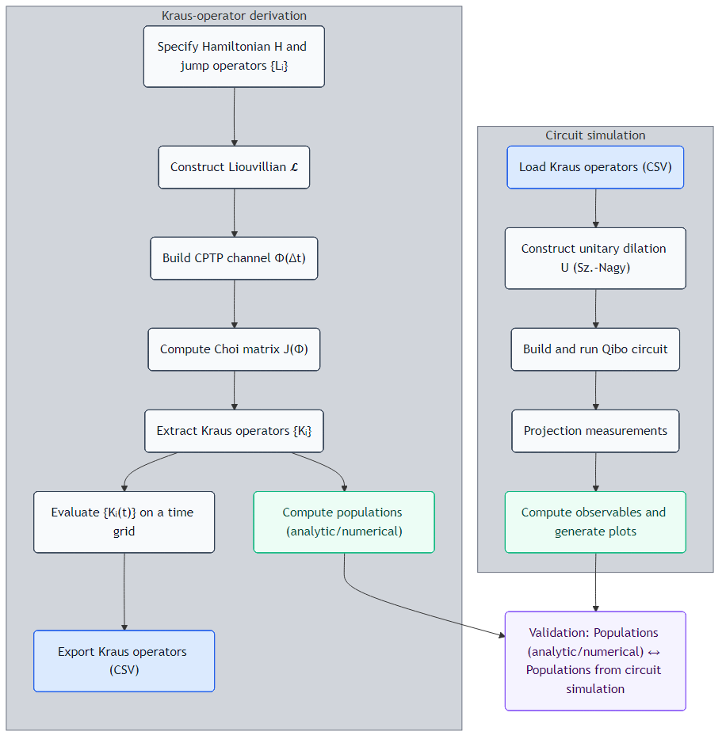
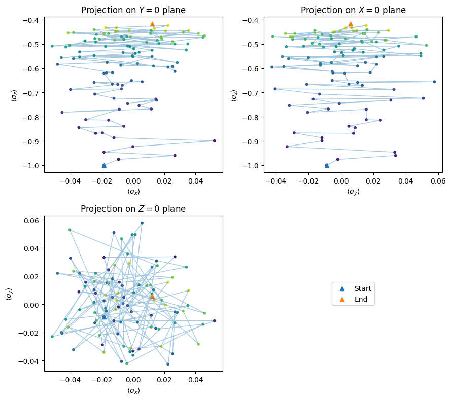
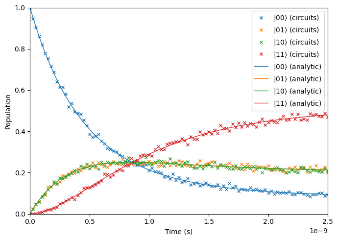

# Open Quantum Systems Dynamics on Quantum-Circuit Simulators (MSc Thesis Showcase)

This public repository showcases the first computational module of my ongoing MSc thesis. This workflow, written in Mathematica and Python, starts from an open-quantum-system model (specified by a Hamiltonian $H$ and jump operators $\{L_i\}$), constructs the corresponding Lindblad dynamics [1], derives a discrete-time CPTP map $\mathcal{E}_t$, and implements that channel as a quantum circuit via a unitary dilation (Sz.-Nagy theorem). Results from the circuit-based dynamics are compared against analytic and/or numerical calculations for representative systems: one and two qubits in thermal baths.

This repository intentionally omits source code and contains only the conceptual workflow and some representative outputs. **The full implementation is available upon request.**

Author: Enrique Arroyo Moro. Citation: see CITATION.cff.

---

## Overview

This workflow consists of compact but complete route from an open-system model to a circuit-level simulation of the corresponding quantum channel (Figure 1). The central idea is:
- Start from a Lindblad-form generator specified by the Hamiltonian $H$ and jump operators $\{L_i\}$.
- Construct a physically valid CPTP map $\mathcal{E}_t$ and obtain a Kraus representation $\{K_j\}$ such that
  $$
  \mathcal{E}_t(\rho)=\sum_j K_j\,\rho\,K_j^\dagger.
  $$
- Realize $\mathcal{E}_t$ on a circuit by embedding it into a larger unitary evolution $U$ acting on system + ancilla, then perform projective measurements and estimate the observables of interest from the measurement statistics.

<figure>
  
  <figcaption>
    <b>Figure 1.</b> End-to-end workflow: Kraus-operator derivation and circuit-based channel simulation via unitary dilation.
  </figcaption>
</figure>

### 1) From open-system model to a CPTP channel

The open dynamics are specified by a Hamiltonian $H$ and jump operators $\{L_i\}$. From these, one constructs the generator of the evolution and then obtains a discrete-time quantum channel $\mathcal{E}_t$. The channel is represented through its Choi matrix $J(\mathcal{E}_t)$ [2], which guarantees complete positivity. A Kraus representation $\{K_j\}$ is then extracted so that the channel can be applied as
$$
\mathcal{E}_t=\sum_j K_j\,\rho\,K_j^\dagger.
$$
For numerical work, the Kraus operators are evaluated on a time grid (one set per time step). These time-stamped Kraus operators constitute the interface between the analytic/derivation stage and the circuit-simulation stage.

### 2) Circuit realization via unitary dilation

A general CPTP map can be implemented by coupling the system to an ancilla, applying a joint unitary $U$, and performing projection measurements [3]. Here, $U$ is constructed from the Kraus operators using a Sz.-Nagy dilation procedure. The resulting unitary is compiled into a quantum circuit and simulated.

After running the circuit on system + ancilla, observables are estimated from the statistics of the projective measurements. Typical observables include state populations in a chosen computational basis and Bloch-vector components for one-qubit cases, $\langle \sigma_\alpha \rangle$ with $\alpha\in\{x,y,z\}$.

### 3) Validation strategy

Validation is performed by comparing observables extracted from the circuit measurements with independent reference predictions computed directly from the model (analytic where available, otherwise numerical). Agreement in population dynamics across time steps is used as the primary quantitative check. Bloch-trajectory plots provide an additional qualitative diagnostic for one-qubit channels.

---

## Sample results

### 1) One-qubit validation: populations (circuit vs analytic)

In Figure 2, the measured one-qubit state populations obtained from the circuit implementation of $\mathcal{E}_t$ (markers) closely follow the analytic/reference solution (solid lines). This indicates that the extracted Kraus operators and the corresponding unitary-dilation circuit reproduce the intended open-system population dynamics.

<figure>
  
  <figcaption>
    <b>Figure 2.</b> One-qubit populations vs time: circuit simulation (markers) compared to analytic reference (lines).
  </figcaption>
</figure>

### 2) One-qubit dynamics: Bloch-vector trajectory projections

In Figure 3, the reduced one-qubit dynamics are visualized through projections of the Bloch vector $\langle \boldsymbol{\sigma} \rangle = (\langle \sigma_x \rangle, \langle \sigma_y \rangle, \langle \sigma_z \rangle)$ onto the coordinate planes, with explicit start and end markers. The trajectory highlights how coherence ($\langle \sigma_x \rangle, \langle \sigma_y \rangle$) and population imbalance ($\langle \sigma_z \rangle$) evolve under the implemented dissipative channel, providing a geometric diagnostic complementary to the population plots.

<figure>
  
  <figcaption>
    <b>Figure 3.</b> One-qubit Bloch-vector trajectory projections, with start/end markers.
  </figcaption>
</figure>

### 3) Two-qubit validation: populations (circuit vs analytic)

In Figure 4, the circuit implementation of the two-qubit channel reproduces the time-dependent populations of the computational-basis states $\{|00\rangle, |01\rangle, |10\rangle, |11\rangle\}$. The circuit estimates (markers), obtained from projective measurement statistics, track the analytic/classical reference curves (solid lines). This agreement indicates that the Kraus extraction and unitary-dilation construction scale beyond the single-qubit case and correctly capture the intended two-qubit open-system population dynamics.

<figure>
  
  <figcaption>
    <b>Figure 4.</b> Two-qubit computational-basis populations vs time: circuit simulation (markers) compared to analytic / classical reference (lines).
  </figcaption>
</figure>

---

## Access to full code

This public repository omits source code; please email me (enriquearroyo.contact@gmail.com) if you are interested in the full implementation (Kraus derivations/exports, unitary dilation, circuit simulation scripts, and reproducibility instructions).

---

## Citation

If you reference this material, please cite my MSc thesis:

Enrique Arroyo Moro, "Quantum Computing Approaches to Quantum Thermalisation in NISQ Devices" (MSc thesis, University of Amsterdam), 2026.

---

## References

[1] D. Manzano, "A short introduction to the Lindblad master equation," AIP Advances 10, 025106 (2020). DOI: 10.1063/1.5115323. https://doi.org/10.1063/1.5115323

[2] E. Andersson, J. D. Cresser, and M. J. W. Hall, "Finding the Kraus decomposition from a master equation and vice versa," arXiv:0801.4100 [quant-ph] (2008). https://arxiv.org/abs/0801.4100

[3] Z. Hu, R. Xia, and S. Kais, "A quantum algorithm for evolving open quantum dynamics on quantum computing devices," Scientific Reports 10, 3301 (2020). DOI: 10.1038/s41598-020-60321-x. https://doi.org/10.1038/s41598-020-60321-x

---
