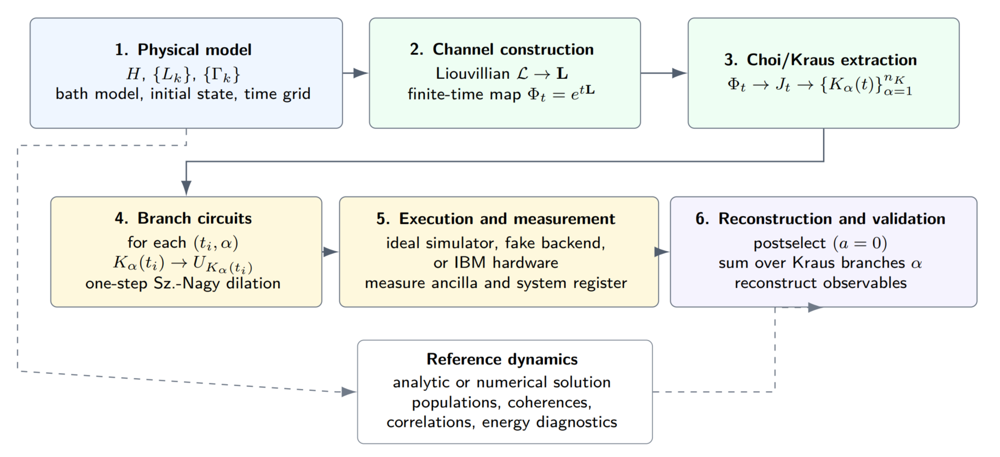
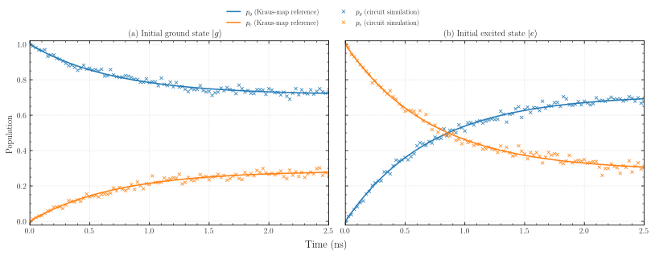
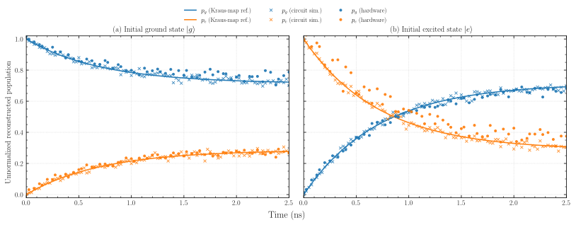
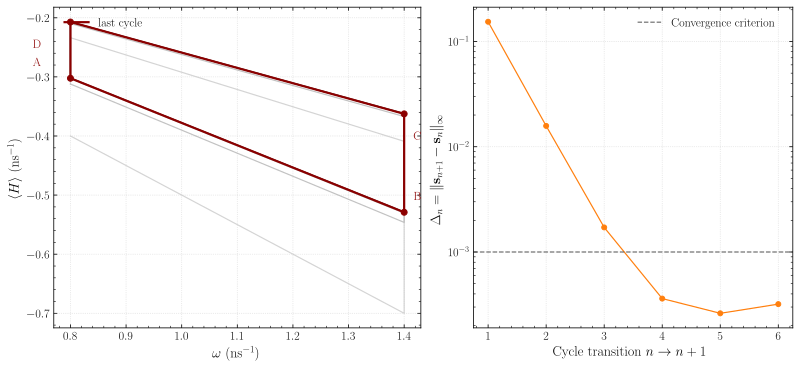

# Quantum Computing Approaches to Quantum Thermalization in NISQ Devices: Showcase

This repository is a compact showcase for the MSc thesis *Quantum Computing Approaches to Quantum Thermalization in NISQ Devices*.

The companion code is already available here: [Full companion code](https://github.com/Enrique-Arroyo/quantum-thermalization-nisq)

## Overview

This showcase summarizes the workflow used for small open quantum systems. The overall route is shown in [Figure 1](#fig-workflow). The physical input is a finite-dimensional open-system model specified by a Hamiltonian $H$, Lindblad jump operators $\{L_k\}$, dissipative rates $\{\Gamma_k\}$, a bath model, an initial state, and a time grid. For each time $t_i$, the Liouvillian $\mathcal{L}$ defines a completely positive trace-preserving (CPTP) channel $\Phi_{t_i}=e^{t_i\mathcal{L}}$ [1].

The channel is represented through its Choi matrix $J_{t_i}$, from which a Kraus representation $\{K_\alpha(t_i)\}_{\alpha=1}^{\kappa}$ is extracted [2]:

$$
\Phi_{t_i}(\rho)=\sum_{\alpha=1}^{\kappa} K_\alpha(t_i)\rho K_\alpha^\dagger(t_i).
$$

The time-stamped Kraus operators are the interface between the open-system model and the circuit realization. Each branch $(t_i,\alpha)$ is embedded into a larger unitary $U_{K_\alpha(t_i)}$ acting on system plus ancilla using a Sz.-Nagy dilation construction, yielding circuits whose measurement statistics reconstruct observables [3]. Validation compares these reconstructed observables with direct numerical or analytic reference predictions.

  

  <b>Figure 1.</b> Workflow from open-system model to channel construction, dilation circuits, and observable reconstruction.

 

## What is shown

- amplitude-damping channel;
- one-qubit finite-temperature thermalization;
- one-qubit thermal-plus-dephasing thermalization;
- two-qubit local thermal-bath simulation;
- one-qubit Otto-cycle channel-composition study;
- selected IBM and fake-backend results.

## Representative results

  

  <b>Figure 2.</b> One-qubit finite-temperature thermalization.

 

  

  <b>Figure 3.</b> IBM hardware comparison for the one-qubit thermal channel.

 

  

  <b>Figure 4.</b> Single-qubit Otto-cycle convergence.

 

## Citation

Citation metadata is provided in `CITATION.cff`.

If you use this material, please cite the repository release and/or the associated MSc thesis:

Enrique Arroyo Moro, *Quantum Computing Approaches to Quantum Thermalization in NISQ Devices*, MSc thesis, University of Amsterdam, 2026.

## References

[1] D. Manzano, "A short introduction to the Lindblad master equation," *AIP Advances* 10, 025106 (2020). DOI: 10.1063/1.5115323. https://doi.org/10.1063/1.5115323

[2] E. Andersson, J. D. Cresser, and M. J. W. Hall, "Finding the Kraus decomposition from a master equation and vice versa," arXiv:0801.4100 [quant-ph] (2008). https://arxiv.org/abs/0801.4100

[3] Z. Hu, R. Xia, and S. Kais, "A quantum algorithm for evolving open quantum dynamics on quantum computing devices," *Scientific Reports* 10, 3301 (2020). DOI: 10.1038/s41598-020-60321-x. https://doi.org/10.1038/s41598-020-60321-x

## License

See `LICENSE` for reuse terms.